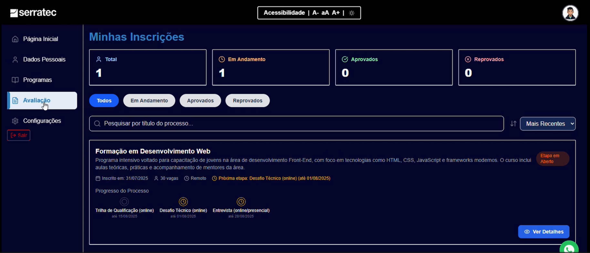

# Etapa 5: Acompanhando sua Jornada

Agora você pode ver o andamento da sua candidatura.

### Encontrando suas Inscrições

<iframe width="560" height="315" src="https://www.youtube.com/embed/S8NEqRfScak?si=INOz81a2cE5evVca&start=376" title="YouTube video player" frameborder="0" allow="accelerometer; autoplay; clipboard-write; encrypted-media; gyroscope; picture-in-picture; web-share" referrerpolicy="strict-origin-when-cross-origin" allowfullscreen></iframe>

> **O que fazer:** No menu da esquerda, clique em **"Programas"**. No topo da página, clique na aba **"Meus Processos"**.

---

### A Linha do Tempo do Processo Seletivo

> **O que você vê:** Um resumo da sua inscrição. Clique em **"Ver Detalhes"**.
>
> **O que acontece:** Uma página se abre, mostrando todas as etapas do processo (Formulário, Desafio, Entrevista, etc.) em uma linha do tempo.

---

### Visão Geral em "Avaliação"

> **O que fazer:** No menu da esquerda, clique em **"Avaliação"**.
>
> **O que você vê:** Um painel de controle que mostra um resumo de todas as vagas para as quais você já se candidatou, organizadas por status.

